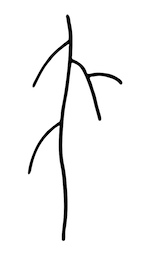

This page provides a set of example rsml files as well as the images the root architecture has been constructed from.

RSML allows to store a variety of content. The basic data contained in an RSML file is the topology and geometry of root system architecture. It can also stored additional data such as the root type (from Plant Ontology), the root diameter and annotations.

####*"Arabidopsis simple"* example

A simple root architecture which contains 1 primary root, 3 first order laterals and 1 second order lateral. Three rsml files are provided.

  - [Download the RSML file with geometry and topology only](images/examples/arabidopsis_simple.rsml)
  - [Download the RSML file with diameter](images/examples/arabidopsis_simple_with_diameter.rsml)
  - [Download the RSML file with additional annotation](images/examples/arabidopsis_simple_annotation.rsml)

<!--ul>
           
  

  
  name: Christophe Godin 
  email: christophe.godin(at)inria.fr 
  phone: (33) 4 67 14 97 91 
  qsdqsd 
  qsdqsd
  

  <!--li>
      <a href="{{ post.url }}">{{ post.title }}</a>
    </li->
  
</ul-->
           
  

  <a href={{ page.url }}> {{ page.title }}</a>
  

  

[Back to RSML home](index)