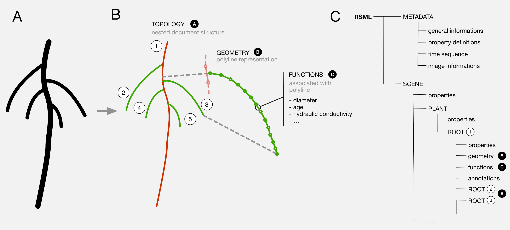

####The RSML file format

The RootSystemML file format is made of two main parts: the *metadata* and the *scene*:

 - [See the definition of the metadata section](metadata)
 - [See the definition of the scene section](scene)

[Back to RSML home](index)

